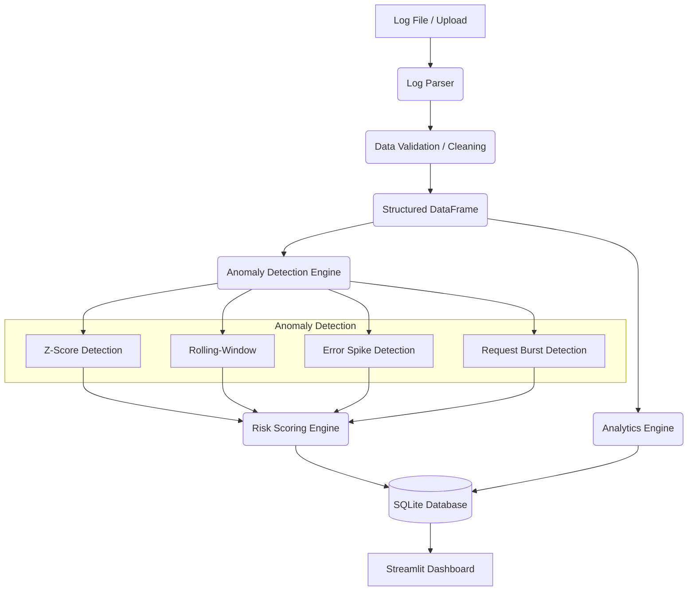

# LogSentinel

**Intelligent Application Log Anomaly Detection Platform**

LogSentinel is a local application that accepts application/server log files, parses and analyzes them, detects abnormal behavior using statistical techniques, assigns anomaly severity/risk scores, stores historical results, and presents them through an interactive dashboard.

This project was built as a demonstration of software engineering, data processing, statistics, and DevOps practices using Python.

## Features

- **Robust Log Parsing:** Parses and cleans application logs.
- **Statistical Anomaly Detection:** Identifies abnormal response times and frequencies.
- **Risk Scoring:** Assigns interpretable severity (LOW, MEDIUM, HIGH) to anomalies based on deviation and error rates.
- **Interactive Dashboard:** Built with Streamlit and Plotly to visualize metrics, error rates, and endpoints.
- **Data Persistence:** Stores logs and anomalies in a local SQLite database.
- **Export Data:** Allows exporting anomaly results to CSV for further review.
- **Dockerized:** Fully deployable via Docker and Docker Compose.
- **CI/CD:** Automated testing using GitHub Actions.

## Architecture

LogSentinel's architecture follows a clean pipeline:



## Technology Stack

- **Python 3.12+**: Core language.
- **Pandas & NumPy**: For efficient data manipulation and statistical calculations.
- **scikit-learn**: Used where complex mathematical utilities are needed.
- **SQLite**: Lightweight, zero-configuration local database to persist historical analysis.
- **Streamlit**: Fast, Python-native framework for building the interactive dashboard.
- **Plotly**: For rich, interactive data visualizations.
- **pytest**: For deterministic unit testing.
- **Docker & Docker Compose**: For containerization and easy deployment without local dependency issues.
- **GitHub Actions**: For Continuous Integration (CI).

## Detection Algorithms

LogSentinel uses multiple statistical techniques to identify suspicious patterns:

- **Z-Score Detection**: Identifies global outliers in response time (e.g., requests taking significantly longer than the overall historical average).
- **Rolling-Window Detection**: Detects localized sudden changes in response time per endpoint, evaluating current requests against recent historical behavior.
- **Error Spike Detection**: Groups logs into time windows and flags periods where error counts significantly exceed the baseline.
- **Request Burst Detection**: Analyzes request frequencies by IP address to find unusual traffic surges (potential abuse or misconfigured clients).
- **Risk Scoring**: Combines the magnitude of deviation, error types, and anomaly characteristics to calculate a transparent 0-100 score, classified into LOW, MEDIUM, and HIGH severity.

## Database Schema

### `logs` table
| Column | Type | Description |
|--------|------|-------------|
| `id` | INTEGER | Primary Key |
| `timestamp` | DATETIME | Time of the request |
| `level` | TEXT | INFO, WARN, ERROR |
| `method` | TEXT | HTTP Method |
| `endpoint` | TEXT | Request endpoint |
| `status_code` | INTEGER | HTTP Status Code |
| `response_time`| INTEGER | Latency in ms |
| `ip_address` | TEXT | Client IP |

### `anomalies` table
| Column | Type | Description |
|--------|------|-------------|
| `id` | INTEGER | Primary Key |
| `timestamp` | DATETIME | Time of the anomaly |
| `endpoint` | TEXT | Endpoint involved |
| `ip_address` | TEXT | Client IP involved |
| `anomaly_type` | TEXT | Type of anomaly detected |
| `observed_value`| REAL | Actual value recorded |
| `baseline_value`| REAL | Expected / Historical mean |
| `anomaly_score` | REAL | Statistical deviation |
| `risk_score` | INTEGER | 0-100 severity score |
| `severity` | TEXT | LOW, MEDIUM, HIGH |
| `reason` | TEXT | Human-readable explanation|

## Installation

### Local Installation

1. Clone the repository:
   ```bash
   git clone https://github.com/yourusername/LogSentinel.git
   cd LogSentinel
   ```

2. Create a virtual environment and activate it:
   ```bash
   python -m venv venv
   # Windows:
   .\venv\Scripts\activate
   # Linux/Mac:
   source venv/bin/activate
   ```

3. Install dependencies:
   ```bash
   pip install -r requirements.txt
   ```

### Docker Installation

1. Clone the repository and navigate to the directory.
2. Run Docker Compose:
   ```bash
   docker-compose up --build
   ```
3. The dashboard will be available at `http://localhost:8501`.

## Usage

1. **Start Application (Local)**:
   ```bash
   streamlit run dashboard/app.py
   ```
2. **Generate Sample Data** (if needed):
   Use the sidebar in the dashboard to generate and process a dataset containing simulated anomalies.
3. **Upload Logs**: Use the file uploader in the sidebar to ingest custom application logs.
4. **Analyze Logs**: The main dashboard displays overall metrics, response time trends, error distributions, and endpoint performance.
5. **Inspect Anomalies**: Navigate to the Anomaly Explorer section to filter and review detected issues.
6. **Export Results**: Click the "Download Anomalies as CSV" button to save findings locally.

## Testing

Run the test suite using pytest:
```bash
pytest tests/
```

## Screenshots

<<<<<<< HEAD


=======


>>>>>>> a7b844157a3643ff1bd4480458caeccd97f31309
